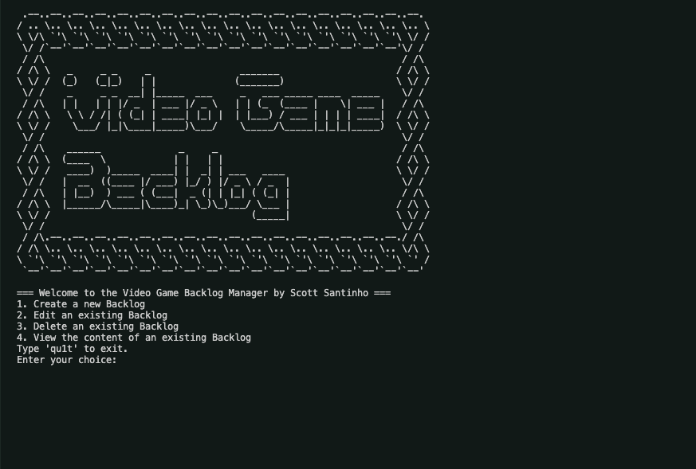

# Video Game Backlog Manager



## Table of Contents
- [Description](#description)
- [Getting Started](#getting-started)
- [Prerequisites](#prerequisites)
- [Installation](#installation)
- [Project Structure](#project-structure)
- [Contributing](#contributing)
- [License](#license)
- [Acknowledgements](#acknowledgements)

---

## Description
The Video Game Backlog Manager is a command-line tool designed to help you create, edit, view, and delete video game backlogs. It leverages the RAWG.io API to fetch game information (release date, metacritic score, and playtime) based on user input. Your backlogs are stored as CSV files, making it easy to manage and archive them.

With this tool, you can:
- Create new backlogs and add games to them.
- Edit existing backlogs by adding, renaming, or deleting entries.
- Delete backlogs entirely.
- View the content of a backlog at any time.
- Keep your RAWG.io API key secure by loading it from a .env file (excluded from version control).

---

## Getting Started

### Prerequisites
- Python 3.x installed on a UNIX-like system (e.g., macOS).
- A RAWG.io API key. Sign up at [RAWG.io](https://rawg.io/) if you don’t have one.
- Internet access for fetching game data.

---

## Installation
1. **Clone the repository:**
   ```bash
   git clone https://github.com/yourusername/video-game-backlog.git
   cd video-game-backlog
   ```
2. **Create and activate a virtual environment (recommended):**
   ```bash
   python3 -m venv venv
   source venv/bin/activate
   ```
3. **Install the required dependencies:**
   ```bash
   pip install -r requirements.txt
   ```
4. **Add your API key to a .env file:**
   ```bash
   echo "API_KEY=YOUR_RAWG_API_KEY_HERE" > .env
   ```
5. **Run the main script:**
   ```bash
   python main.py
   ```

---

## Project Structure
```
video-game-backlog/
├─ classes/
│  ├─ __init__.py
│  ├─ backlog_manager.py       # Backlog CRUD operations
│  ├─ cli_handler.py           # User interaction and menu handling
│  ├─ game_searcher.py         # Interfacing with RAWG API
│  └─ utilities.py             # Helper functions
├─ data/                       # Stored CSV files for backlogs
├─ .env                        # API key (not tracked by git)
├─ requirements.txt
├─ LICENSE
└─ main.py                     # Entry point of the application
```

---

## Contributing
1. **Fork the repository.**
2. **Create a new branch for your changes:**
   ```bash
   git checkout -b feature/new-feature
   ```
3. **Make your changes and test them.**
4. **Commit and push your branch:**
   ```bash
   git commit -m "Add new feature"
   git push origin feature/new-feature
   ```
5. **Create a Pull Request** describing what you’ve done and why.

---

## License
This project is licensed under the terms of the MIT License.

---

## Acknowledgements
- Thanks to OpenAI’s o1 for refactoring and initial guidance.
- RAWG.io for the excellent game database and API.
- The open-source community for all the tools and libraries that made this project possible.
